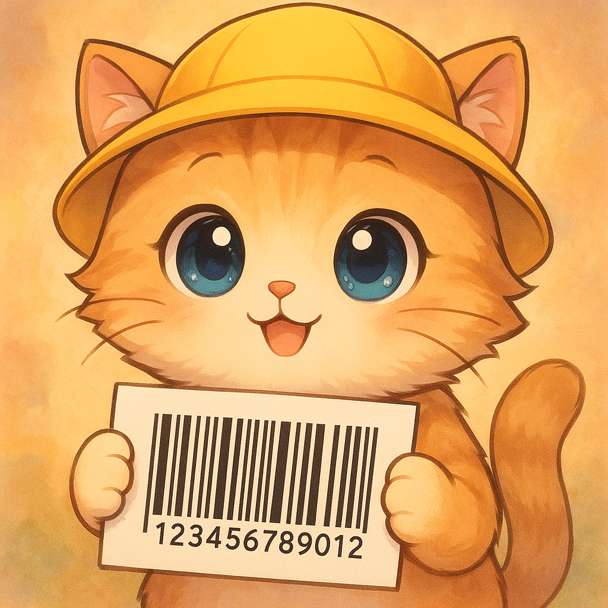
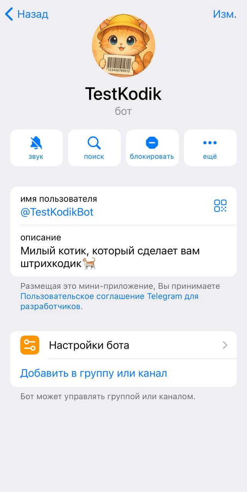
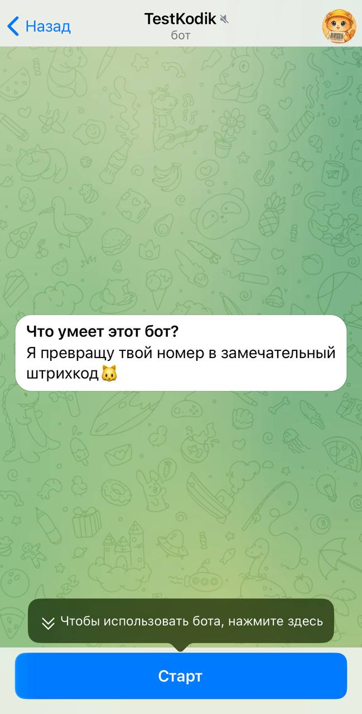

# 📦 TestKodik v1.1 

TestKodik - это телеграм-бот для генерации штрихкодов **Code128** в формате **PNG** по введённому числовому коду товара.
Проект упакован в **Docker** и готов к использованию без лишних настроек.

<p align="center">
  
</p>

<p align="center">
  

  

  
</p>


---

## ✨ Возможности  

- 📥 Получает от пользователя **номер товара** (только цифры).  
- 🖼 Генерирует **штрихкод Code128** в PNG.  
- 📄 Отправляет готовый файл обратно в чат.  
- 📝 Ведёт логирование в файл `logs/bot.log`.  

---

## 🎬 Пример работы  

<p align="center">
    
    
    
</p>
 

---

## 🚀 Быстрый старт  

### 1. Получите токен бота  
Создайте нового бота через [BotFather](https://t.me/BotFather) и скопируйте выданный `BOT_TOKEN`.  

### 2. Загрузить готовый контейнер Docker

    docker pull kushogimi/testkodik_bot:v1.0

### 3. Запустите контейнер

    docker run -e BOT_TOKEN=ваш_токен ghcr.io/username/testkodik-bot:latest
    
---

## ⚙️ Локальный запуск (без Docker)

Если хотите развернуть проект у себя локально:

    # Клонируем репозиторий
    git clone https://github.com/username/testkodik-bot.git
    cd testkodik-bot
    
    # Создаём виртуальное окружение
    python -m venv .venv
    
    # Активируем виртуальное окружение
    source .venv/bin/activate   # Linux/Mac
    # или
    .venv\Scripts\activate      # Windows
    
    # Устанавливаем зависимости
    pip install -r requirements.txt
    
    # Создаём файл .env и добавляем в него токен
    echo "BOT_TOKEN=ваш_токен" > .env
    
    # Запускаем бота
    python bot.py

---

## 🐳 Docker: сборка собственного образа

Если хотите собрать Docker-образ самостоятельно:

    # Клонируем репозиторий с проектом
    git clone https://github.com/kushogimi/testkodik-bot.git
    cd testkodik-bot
    
    # Собираем Docker-образ с тегом testkodik-bot
    docker build -t testkodik-bot .
    
    # Запускаем контейнер, передавая токен бота через переменную окружения
    docker run -e BOT_TOKEN=ваш_токен_бота testkodik-bot

---

## 📂 Структура проекта
```python
    testkodik-bot/
    ├─ logs/    # Директория для логов (создаётся автоматически)
    │ └─ bot.log    # Файл логов бота
    ├─ bot.py   # Основной исполняемый файл бота
    ├─ config.py    # Модуль для загрузки конфигурации (BOT_TOKEN)
    ├─ requirements.txt     # Файл зависимостей Python-пакетов
    ├─ Dockerfile   # Конфигурация для сборки Docker-образа
    ├─ .dockerignore    # Файлы, исключаемые из Docker-контекста
    ├─ .gitignore   # Файлы, исключаемые из Git-репозитория
    └─ README.md    # Документация проекта
```

---

## 🛠 Используемые библиотеки

- **python-telegram-bot** — современная асинхронная библиотека для взаимодействия с Telegram Bot API
- **python-barcode** — генерация штрихкодов в различных форматах (EAN-13, Code128, UPC-A и др.)
- **Pillow** — работа с изображениями: обработка, конвертация и манипуляция графическими файлами
- **python-dotenv** — загрузка переменных окружения из .env файлов
- **logging** — встроенная библиотека Python для логирования работы приложения

