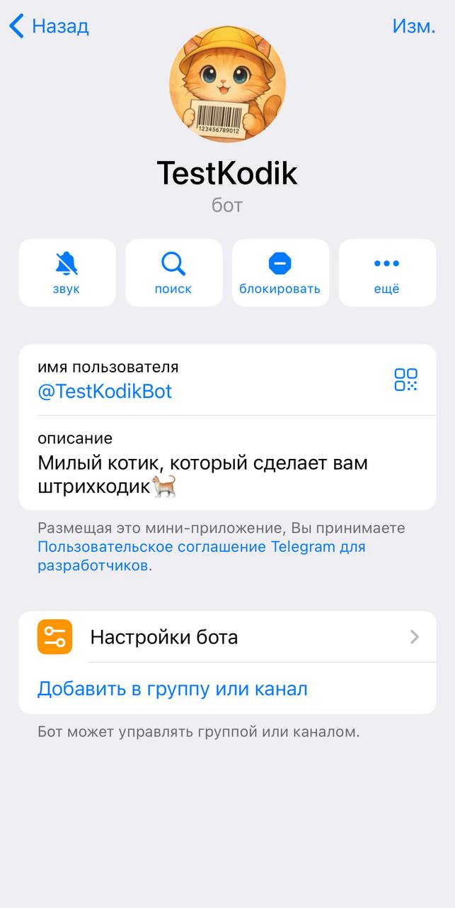
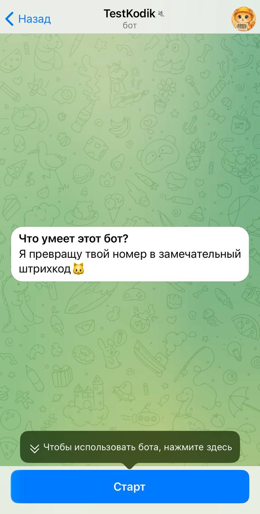
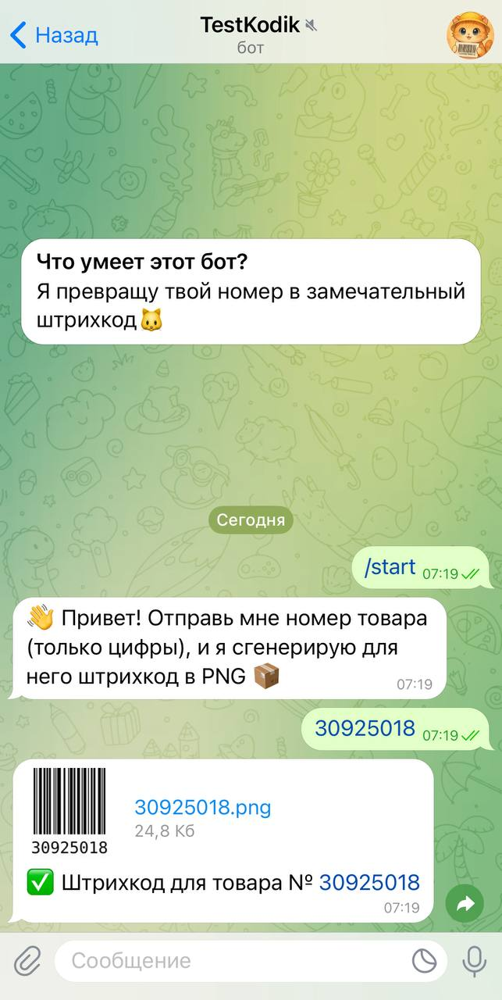

# 📦 TestKodik v1.0  

TestKodik - это телеграм-бот для генерации штрихкодов **Code128** в формате **PNG** по введённому числовому коду товара.
Проект упакован в **Docker** и готов к использованию без лишних настроек.

<p align="center">
  
</p>

<p align="center">
  <svg
    width="50px"
    height="50px"
    viewBox="0 0 32 32"
    fill="none"
    xmlns="http://www.w3.org/2000/svg"
  >
    <path
      fill-rule="evenodd"
      clip-rule="evenodd"
      d="M13.0164 2C10.8193 2 9.03825 3.72453 9.03825 5.85185V8.51852H15.9235V9.25926H5.97814C3.78107 9.25926 2 10.9838 2 13.1111L2 18.8889C2 21.0162 3.78107 22.7407 5.97814 22.7407H8.27322V19.4815C8.27322 17.3542 10.0543 15.6296 12.2514 15.6296H19.5956C21.4547 15.6296 22.9617 14.1704 22.9617 12.3704V5.85185C22.9617 3.72453 21.1807 2 18.9836 2H13.0164ZM12.0984 6.74074C12.8589 6.74074 13.4754 6.14378 13.4754 5.40741C13.4754 4.67103 12.8589 4.07407 12.0984 4.07407C11.3378 4.07407 10.7213 4.67103 10.7213 5.40741C10.7213 6.14378 11.3378 6.74074 12.0984 6.74074Z"
      fill="url(#paint0_linear_87_8204)"
    />
    <path
      fill-rule="evenodd"
      clip-rule="evenodd"
      d="M18.9834 30C21.1805 30 22.9616 28.2755 22.9616 26.1482V23.4815L16.0763 23.4815L16.0763 22.7408L26.0217 22.7408C28.2188 22.7408 29.9998 21.0162 29.9998 18.8889V13.1111C29.9998 10.9838 28.2188 9.25928 26.0217 9.25928L23.7266 9.25928V12.5185C23.7266 14.6459 21.9455 16.3704 19.7485 16.3704L12.4042 16.3704C10.5451 16.3704 9.03809 17.8296 9.03809 19.6296L9.03809 26.1482C9.03809 28.2755 10.8192 30 13.0162 30H18.9834ZM19.9015 25.2593C19.1409 25.2593 18.5244 25.8562 18.5244 26.5926C18.5244 27.329 19.1409 27.9259 19.9015 27.9259C20.662 27.9259 21.2785 27.329 21.2785 26.5926C21.2785 25.8562 20.662 25.2593 19.9015 25.2593Z"
      fill="url(#paint1_linear_87_8204)"
    />
    <defs>
      <linearGradient
        id="paint0_linear_87_8204"
        x1="12.4809"
        y1="2"
        x2="12.4809"
        y2="22.7407"
        gradientUnits="userSpaceOnUse"
      >
        <stop stop-color="#327EBD" />
        <stop offset="1" stop-color="#1565A7" />
      </linearGradient>
      <linearGradient
        id="paint1_linear_87_8204"
        x1="19.519"
        y1="9.25928"
        x2="19.519"
        y2="30"
        gradientUnits="userSpaceOnUse"
      >
        <stop stop-color="#FFDA4B" />
        <stop offset="1" stop-color="#F9C600" />
      </linearGradient>
    </defs>
  </svg>
  <svg
    width="50px"
    height="50px"
    viewBox="0 0 16 16"
    xmlns="http://www.w3.org/2000/svg"
    fill="none"
  >
    <path
      fill="#2396ED"
      d="M12.342 4.536l.15-.227.262.159.116.083c.28.216.869.768.996 1.684.223-.04.448-.06.673-.06.534 0 .893.124 1.097.227l.105.057.068.045.191.156-.066.2a2.044 2.044 0 01-.47.73c-.29.299-.8.652-1.609.698l-.178.005h-.148c-.37.977-.867 2.078-1.702 3.066a7.081 7.081 0 01-1.74 1.488 7.941 7.941 0 01-2.549.968c-.644.125-1.298.187-1.953.185-1.45 0-2.73-.288-3.517-.792-.703-.449-1.243-1.182-1.606-2.177a8.25 8.25 0 01-.461-2.83.516.516 0 01.432-.516l.068-.005h10.54l.092-.007.149-.016c.256-.034.646-.11.92-.27-.328-.543-.421-1.178-.268-1.854a3.3 3.3 0 01.3-.81l.108-.187zM2.89 5.784l.04.007a.127.127 0 01.077.082l.006.04v1.315l-.006.041a.127.127 0 01-.078.082l-.039.006H1.478a.124.124 0 01-.117-.088l-.007-.04V5.912l.007-.04a.127.127 0 01.078-.083l.039-.006H2.89zm1.947 0l.039.007a.127.127 0 01.078.082l.006.04v1.315l-.007.041a.127.127 0 01-.078.082l-.039.006H3.424a.125.125 0 01-.117-.088L3.3 7.23V5.913a.13.13 0 01.085-.123l.039-.007h1.413zm1.976 0l.039.007a.127.127 0 01.077.082l.007.04v1.315l-.007.041a.127.127 0 01-.078.082l-.039.006H5.4a.124.124 0 01-.117-.088l-.006-.04V5.912l.006-.04a.127.127 0 01.078-.083l.039-.006h1.413zm1.952 0l.039.007a.127.127 0 01.078.082l.007.04v1.315a.13.13 0 01-.085.123l-.04.006H7.353a.124.124 0 01-.117-.088l-.006-.04V5.912l.006-.04a.127.127 0 01.078-.083l.04-.006h1.412zm1.97 0l.039.007a.127.127 0 01.078.082l.006.04v1.315a.13.13 0 01-.085.123l-.039.006H9.322a.124.124 0 01-.117-.088l-.006-.04V5.912l.006-.04a.127.127 0 01.078-.083l.04-.006h1.411zM4.835 3.892l.04.007a.127.127 0 01.077.081l.007.041v1.315a.13.13 0 01-.085.123l-.039.007H3.424a.125.125 0 01-.117-.09l-.007-.04V4.021a.13.13 0 01.085-.122l.039-.007h1.412zm1.976 0l.04.007a.127.127 0 01.077.081l.007.041v1.315a.13.13 0 01-.085.123l-.039.007H5.4a.125.125 0 01-.117-.09l-.006-.04V4.021l.006-.04a.127.127 0 01.078-.082l.039-.007h1.412zm1.953 0c.054 0 .1.037.117.088l.007.041v1.315a.13.13 0 01-.085.123l-.04.007H7.353a.125.125 0 01-.117-.09l-.006-.04V4.021l.006-.04a.127.127 0 01.078-.082l.04-.007h1.412zm0-1.892c.054 0 .1.037.117.088l.007.04v1.316a.13.13 0 01-.085.123l-.04.006H7.353a.124.124 0 01-.117-.088l-.006-.04V2.128l.006-.04a.127.127 0 01.078-.082L7.353 2h1.412z"
    />
  </svg>
  <svg
    width="50px"
    height="50px"
    viewBox="0 0 32 32"
    fill="none"
    xmlns="http://www.w3.org/2000/svg"
  >
    <circle cx="16" cy="16" r="14" fill="url(#paint0_linear_87_7225)" />
    <path
      d="M22.9866 10.2088C23.1112 9.40332 22.3454 8.76755 21.6292 9.082L7.36482 15.3448C6.85123 15.5703 6.8888 16.3483 7.42147 16.5179L10.3631 17.4547C10.9246 17.6335 11.5325 17.541 12.0228 17.2023L18.655 12.6203C18.855 12.4821 19.073 12.7665 18.9021 12.9426L14.1281 17.8646C13.665 18.3421 13.7569 19.1512 14.314 19.5005L19.659 22.8523C20.2585 23.2282 21.0297 22.8506 21.1418 22.1261L22.9866 10.2088Z"
      fill="white"
    />
    <defs>
      <linearGradient
        id="paint0_linear_87_7225"
        x1="16"
        y1="2"
        x2="16"
        y2="30"
        gradientUnits="userSpaceOnUse"
      >
        <stop stop-color="#37BBFE" />
        <stop offset="1" stop-color="#007DBB" />
      </linearGradient>
    </defs>
  </svg>
</p>


---

## ✨ Возможности  

- 📥 Получает от пользователя **номер товара** (только цифры).  
- 🖼 Генерирует **штрихкод Code128** в PNG.  
- 📄 Отправляет готовый файл обратно в чат.  
- 📝 Ведёт логирование в файл `logs/bot.log`.  

---

## 🎬 Пример работы  

<p align="center">
    
    
    
</p>
 

---

## 🚀 Быстрый старт  

### 1. Получите токен бота  
Создайте нового бота через [BotFather](https://t.me/BotFather) и скопируйте выданный `BOT_TOKEN`.  

### 2. Загрузить готовый контейнер Docker

    docker pull kushogimi/testkodik_bot:v1.0

### 3. Запустите контейнер

    docker run -e BOT_TOKEN=ваш_токен ghcr.io/username/testkodik-bot:latest
    
---

## ⚙️ Локальный запуск (без Docker)

Если хотите развернуть проект у себя локально:

    # Клонируем репозиторий
    git clone https://github.com/username/testkodik-bot.git
    cd testkodik-bot
    
    # Создаём виртуальное окружение
    python -m venv .venv
    
    # Активируем виртуальное окружение
    source .venv/bin/activate   # Linux/Mac
    # или
    .venv\Scripts\activate      # Windows
    
    # Устанавливаем зависимости
    pip install -r requirements.txt
    
    # Создаём файл .env и добавляем в него токен
    echo "BOT_TOKEN=ваш_токен" > .env
    
    # Запускаем бота
    python bot.py

---

## 🐳 Docker: сборка собственного образа

Если хотите собрать Docker-образ самостоятельно:

    # Клонируем репозиторий с проектом
    git clone https://github.com/kushogimi/testkodik-bot.git
    cd testkodik-bot
    
    # Собираем Docker-образ с тегом testkodik-bot
    docker build -t testkodik-bot .
    
    # Запускаем контейнер, передавая токен бота через переменную окружения
    docker run -e BOT_TOKEN=ваш_токен_бота testkodik-bot

---

## 📂 Структура проекта
```python
    testkodik-bot/
    ├─ logs/    # Директория для логов (создаётся автоматически)
    │ └─ bot.log    # Файл логов бота
    ├─ bot.py   # Основной исполняемый файл бота
    ├─ config.py    # Модуль для загрузки конфигурации (BOT_TOKEN)
    ├─ requirements.txt     # Файл зависимостей Python-пакетов
    ├─ Dockerfile   # Конфигурация для сборки Docker-образа
    ├─ .dockerignore    # Файлы, исключаемые из Docker-контекста
    ├─ .gitignore   # Файлы, исключаемые из Git-репозитория
    └─ README.md    # Документация проекта
```

---

## 🛠 Используемые библиотеки

- **python-telegram-bot** — современная асинхронная библиотека для взаимодействия с Telegram Bot API
- **python-barcode** — генерация штрихкодов в различных форматах (EAN-13, Code128, UPC-A и др.)
- **Pillow** — работа с изображениями: обработка, конвертация и манипуляция графическими файлами
- **python-dotenv** — загрузка переменных окружения из .env файлов
- **logging** — встроенная библиотека Python для логирования работы приложения

